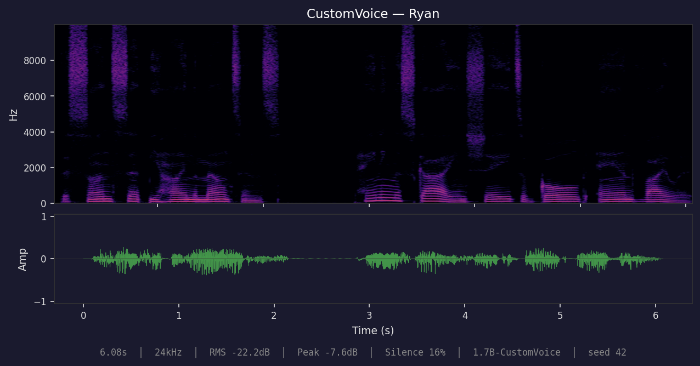
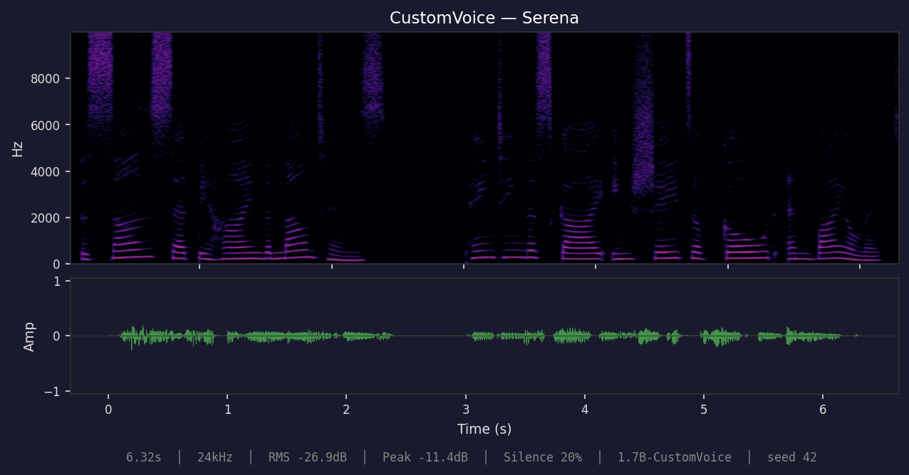
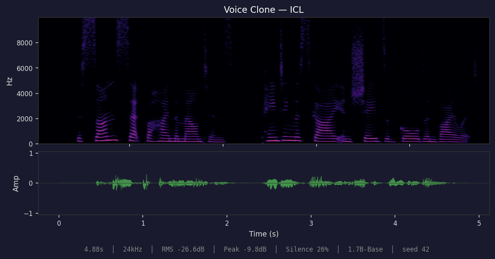
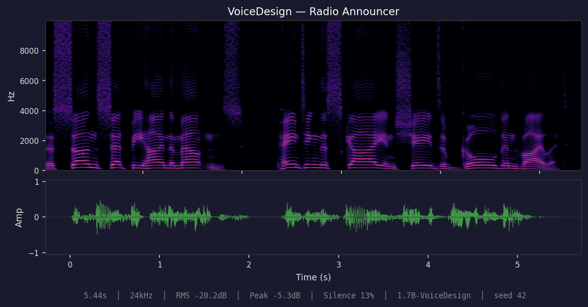
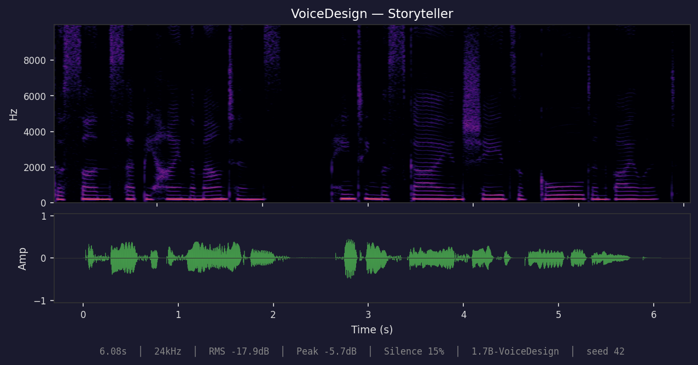
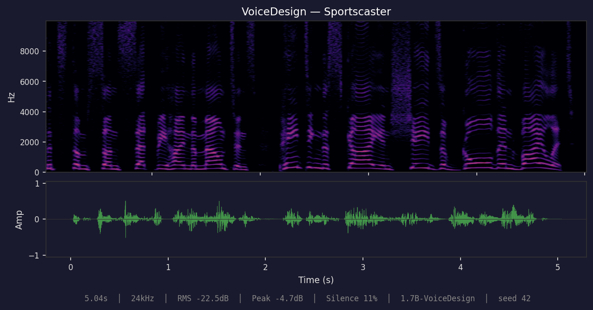

Forked from https://github.com/TrevorS/qwen3-tts-rs.

# qwen3-tts

Pure Rust inference for [Qwen3-TTS](https://github.com/QwenLM/Qwen3-TTS), a text-to-speech model from Alibaba. Built on [candle](https://github.com/huggingface/candle) — no Python or ONNX runtime required.

All code in this repo was written with [Claude Code](https://claude.ai/code). This is an experiment -- not a production library.

## Changelog

### 0.4.0

- Pre-allocated KV cache with InplaceOp2 (zero-copy CUDA writes, no Tensor::cat)
- GPU-side repetition penalty mask (incremental slice_assign, eliminates growing CPU transfer)
- Deferred acoustic codes transfer (single bulk GPU→CPU at end of generation)
- Fused residual + RMSNorm CUDA kernel
- GPU→CPU syncs reduced from 3/frame to 1/frame (4-byte EOS check)
- Non-streaming RTF: 0.48–0.67 across all variants (97-100% of theoretical throughput)

### 0.3.0

- GPU-side sampling: batched argmax, on-device top-k/top-p/repetition penalty
- Eliminated 15 of 16 GPU→CPU syncs per frame in code predictor
- Cached token suppression mask in streaming sessions
- Tokenizer fallback from vocab.json + merges.txt when tokenizer.json is unavailable
- Profiling infrastructure: Chrome tracing, flamegraph, Nsight Systems via Makefile
- Benchmarked all 4 model variants (0.6B Base, 1.7B Base/CustomVoice/VoiceDesign)
- Self-contained model directories (removed tokenizer symlinks)
- Enhanced waveform plots with stats annotation bar

### 0.2.0

- ICL voice cloning now works correctly with proper reference audio
- Fixed WAV output format (WAVEX/float32 → standard WAV/PCM16) — resolves playback speed issues in some players
- Improved tokenizer path resolution with explicit `--tokenizer-dir` override
- Added benchmarking suite (Criterion micro-benchmarks + E2E speed tests)
- Automatic resampling of reference audio to 24kHz for voice cloning
- Docker base image updated to NGC pytorch:25.11 (CUDA 13.0)

Thanks to [u/rngesius](https://www.reddit.com/r/LocalLLaMA/comments/1qqvb79/comment/o2nv6qm/) for feedback on playback speed and tokenizer issues.

## Acknowledgements

- [Qwen Team (Alibaba)](https://github.com/QwenLM) — [Qwen3-TTS](https://github.com/QwenLM/Qwen3-TTS) model, weights, and [technical report](https://arxiv.org/abs/2601.15621)
- [candle](https://github.com/huggingface/candle) — Rust ML framework by [Hugging Face](https://huggingface.co/)
- [mlx-audio](https://github.com/Blaizzy/mlx-audio) — reference implementation that helped clarify model details
- [Claude Code](https://claude.ai/code) — wrote the code

## Features

- **CPU inference** with optional MKL/Accelerate for faster BLAS operations
- **CUDA** support for NVIDIA GPU acceleration with **bf16** and **Flash Attention 2**
- **Metal** support for Apple Silicon
- **Streaming synthesis** for low-latency audio output
- **Voice cloning** via x-vector or ICL (in-context learning) from reference audio (Base models)
- **Preset speakers** with 9 built-in voices (CustomVoice models)
- **Text-described voices** via natural language prompts (VoiceDesign models)
- **Auto-detection** of model variant from `config.json`
- **HuggingFace Hub integration** for easy model downloads

## Quick Serve

### CPU (Docker)

```bash
./build-docker.sh qwen3-tts-cpu "" cpu serve
docker run -e BASE_MODEL_DIR=/models/Qwen3-TTS-12Hz-1.7B-Base \
  -e VOICE_DESIGN_MODEL_DIR=/models/Qwen3-TTS-12Hz-1.7B-VoiceDesign \
  -e TOKENIZER_DIR=/models/tokenizer -e DEVICE=cpu -p 8010:8000 \
  -v /path/to/models:/models qwen3-tts-cpu
```

### GPU (Docker)

```bash
./build-docker.sh qwen3-tts-gpu "flash-attn,cli,server" gpu serve
docker run --gpus all -e BASE_MODEL_DIR=/models/Qwen3-TTS-12Hz-1.7B-Base \
  -e VOICE_DESIGN_MODEL_DIR=/models/Qwen3-TTS-12Hz-1.7B-VoiceDesign \
  -e TOKENIZER_DIR=/models/tokenizer -e DEVICE=cuda -p 8010:8000 \
  -v /path/to/models:/models qwen3-tts-gpu
```

Notes:
- `TOKENIZER_DIR` should point to a directory containing `tokenizer.json`.
- `duration_seconds` is a max length; generation can stop early at EOS.

## HTTP API

All endpoints return `audio/mpeg` (MP3) unless noted.

### Endpoints

| Method | Path | Description | Request type |
| --- | --- | --- | --- |
| POST | `/v1/audio/voice-design` | VoiceDesign synthesis from text + instruct | JSON |
| POST | `/v1/audio/voice-clone/prompt` | Build reusable prompt (speaker + ICL codes) | multipart/form-data |
| POST | `/v1/audio/voice-clone` | Base voice clone using a saved prompt | JSON |

### Flow (Design → Clone)

```
client
  | POST /v1/audio/voice-design (text + instruct)  --> mp3
  | mp3 -> wav (ffmpeg)
  | POST /v1/audio/voice-clone/prompt (ref_audio + ref_text) --> prompt JSON
  | POST /v1/audio/voice-clone (text + prompt) --> mp3
```

### Request schemas

**VoiceDesign**

```json
{
  "text": "Hello",
  "instruct": "A soft-spoken, airy, high-tone female narrator in her 20s, whispering gently with calm breathiness.",
  "language": "korean",
  "options": {
    "duration_seconds": 15,
    "temperature": 0.7,
    "top_k": 50,
    "top_p": 0.9,
    "repetition_penalty": 1.05,
    "seed": 42
  }
}
```

**Voice Clone Prompt (multipart/form-data)**

- `ref_audio`: WAV file (required)
- `ref_text`: transcript text (optional, recommended for ICL)
- `x_vector_only`: `true`/`1` to skip ICL codes

**Voice Clone**

```json
{
  "text": "Hello",
  "language": "korean",
  "options": { "duration_seconds": 15 },
  "prompt": {
    "speaker_embedding": [0.0, 0.1, 0.2],
    "ref_codes": [[2149, 10, 11], [2149, 12, 13]],
    "ref_text_ids": [1, 2, 3]
  }
}
```

### Example requests

**VoiceDesign → mp3**

```bash
curl -X POST http://localhost:8010/v1/audio/voice-design \
  -H "Content-Type: application/json" \
  -d '{"text":"오빠.. 나 당장 갈 것 같아.. 빨리 와줬으면 좋겠어. 부탁이야.","instruct":"A soft-spoken, airy, high-tone female narrator in her 20s, whispering gently with calm breathiness.","language":"korean","options":{"duration_seconds":15}}' \
  -o voice_design.mp3
```

**Prompt 생성**

```bash
curl -X POST http://localhost:8010/v1/audio/voice-clone/prompt \
  -F "ref_audio=@voice_design.wav" \
  -F "ref_text=오빠.. 나 당장 갈 것 같아.. 빨리 와줬으면 좋겠어. 부탁이야." \
  -o prompt.json
```

**Voice Clone → mp3**

```bash
curl -X POST http://localhost:8010/v1/audio/voice-clone \
  -H "Content-Type: application/json" \
  -d "$(jq -c --arg text '오빠.. 나 당장 갈 것 같아.. 빨리 와줬으면 좋겠어. 부탁이야.' '{text:$text, language:"korean", options:{duration_seconds:15}, prompt:.prompt}' prompt.json)" \
  -o voice_clone.mp3
```

## Performance

Benchmarked on an NVIDIA DGX Spark (GB10 Blackwell, ARM Cortex-X925, 120 GB unified memory).
Default generation parameters, seed 42, 2 warmup + 3 timed iterations.

| Model | RTF (short) | RTF (long) | Tok/s | Memory |
|-------|-------------|------------|-------|--------|
| **0.6B Base (CUDA BF16)** | **0.48** | **0.50** | 25.9 | 767 MB |
| **1.7B Base (CUDA BF16)** | **0.65** | **0.65** | 19.4 | 767 MB |
| **1.7B CustomVoice (CUDA BF16)** | **0.64** | **0.67** | 19.2 | 772 MB |
| **1.7B VoiceDesign (CUDA BF16)** | **0.64** | **0.66** | 19.3 | 770 MB |
| 1.7B CustomVoice (CPU F32) | 5.39 | 6.48 | 2.1 | 9.1 GB |

RTF (real-time factor) = wall-clock / audio duration. **< 1.0 is faster than real-time.**
Non-streaming results shown above. Streaming adds ~8-12% overhead with TTFA ~444 ms (0.6B) / ~580 ms (1.7B).

See [docs/BENCHMARKS.md](docs/BENCHMARKS.md) for full results, test corpus, micro-benchmarks, and reproduction instructions.

## Samples

All samples generated with 1.7B models, seed 42. Text: *"The sun set behind the mountains, painting the sky in shades of gold and violet."*

### CustomVoice — Ryan


[🔊 Listen](assets/audio/customvoice-ryan.wav)

### CustomVoice — Serena


[🔊 Listen](assets/audio/customvoice-serena.wav)

### Voice Clone — ICL


[🔊 Listen](assets/audio/voiceclone-icl.wav)

### VoiceDesign — Radio Announcer


[🔊 Listen](assets/audio/voicedesign-radio.wav)

### VoiceDesign — Storyteller


[🔊 Listen](assets/audio/voicedesign-storyteller.wav)

### VoiceDesign — Sportscaster


[🔊 Listen](assets/audio/voicedesign-sportscaster.wav)

## Model Variants

Five official model variants exist across two size classes. Each variant supports a different speaker conditioning method:

| Variant | Params | Speaker Conditioning | Use Case |
|---------|--------|---------------------|----------|
| **0.6B Base** | 1.8 GB | Voice cloning from reference audio | Clone any voice from a WAV file |
| **0.6B CustomVoice** | 1.8 GB | 9 preset speakers | Pick from built-in voices |
| **1.7B Base** | 3.9 GB | Voice cloning from reference audio | Higher quality voice cloning |
| **1.7B CustomVoice** | 3.9 GB | 9 preset speakers | Higher quality preset voices |
| **1.7B VoiceDesign** | 3.8 GB | Text description | Describe a voice in natural language |

### Which model should I use?

- **Want to clone a specific voice?** Use a **Base** model with `--ref-audio` (ICL mode) or `--ref-audio --x-vector-only` (faster, lower quality).
- **Want a quick preset voice?** Use a **CustomVoice** model with `--speaker`.
- **Want to describe a voice in text?** Use **1.7B VoiceDesign** with `--instruct`.
- **Unsure?** Start with **0.6B CustomVoice** for the fastest results.

### Valid combinations

| | Preset speakers | Voice clone (x_vector) | Voice clone (ICL) | Text-described voice |
|---|:-:|:-:|:-:|:-:|
| **Base** | | x | x | |
| **CustomVoice** | x | | | |
| **VoiceDesign** | | | | x |

Using the wrong combination (e.g. preset speakers on a Base model) won't crash, but produces unpredictable voice output. The library and CLI warn when this happens.

## Installation

Add to your `Cargo.toml`:

```toml
[dependencies]
qwen3-tts = { version = "0.1", features = ["hub"] }
```

### Feature Flags

| Feature | Description |
|---------|-------------|
| `cpu` (default) | CPU inference |
| `cuda` | NVIDIA GPU acceleration |
| `flash-attn` | Flash Attention 2 (requires CUDA toolkit; enables bf16 compute) |
| `metal` | Apple Silicon GPU acceleration |
| `mkl` | Intel MKL for faster CPU inference |
| `accelerate` | Apple Accelerate framework |
| `hub` | HuggingFace Hub model downloads |
| `cli` | Command-line tools |

## Quick Start

### Preset speakers (CustomVoice)

```rust
use qwen3_tts::{Qwen3TTS, Speaker, Language, auto_device};

fn main() -> anyhow::Result<()> {
    let device = auto_device()?;
    let model = Qwen3TTS::from_pretrained("path/to/customvoice_model", device)?;

    let audio = model.synthesize_with_voice(
        "Hello, world!",
        Speaker::Ryan,
        Language::English,
        None,
    )?;
    audio.save("output.wav")?;
    Ok(())
}
```

Available speakers: `Serena`, `Vivian`, `UncleFu`, `Ryan`, `Aiden`, `OnoAnna`, `Sohee`, `Eric`, `Dylan`

### Voice cloning (Base)

```rust
use qwen3_tts::{Qwen3TTS, Language, AudioBuffer, auto_device};

fn main() -> anyhow::Result<()> {
    let device = auto_device()?;
    let model = Qwen3TTS::from_pretrained("path/to/base_model", device)?;

    // Load reference audio
    let ref_audio = AudioBuffer::load("reference_voice.wav")?;

    // ICL mode: full voice cloning with reference text
    let prompt = model.create_voice_clone_prompt(&ref_audio, Some("transcript of ref audio"))?;

    // x_vector_only: faster, speaker embedding only (no reference text needed)
    // let prompt = model.create_voice_clone_prompt(&ref_audio, None)?;

    let audio = model.synthesize_voice_clone(
        "Hello in the cloned voice!",
        &prompt,
        Language::English,
        None,
    )?;
    audio.save("cloned.wav")?;
    Ok(())
}
```

### Text-described voice (VoiceDesign)

```rust
use qwen3_tts::{Qwen3TTS, Language, auto_device};

fn main() -> anyhow::Result<()> {
    let device = auto_device()?;
    let model = Qwen3TTS::from_pretrained("path/to/voicedesign_model", device)?;

    let audio = model.synthesize_voice_design(
        "Hello from a designed voice!",
        "A cheerful young female voice with high pitch and energetic tone",
        Language::English,
        None,
    )?;
    audio.save("designed.wav")?;
    Ok(())
}
```

### With custom options

```rust
use qwen3_tts::{Qwen3TTS, SynthesisOptions, auto_device};

fn main() -> anyhow::Result<()> {
    let device = auto_device()?;
    let model = Qwen3TTS::from_pretrained("path/to/model", device)?;

    let options = SynthesisOptions {
        temperature: 0.8,
        top_k: 30,
        top_p: 0.85,
        repetition_penalty: 1.05,
        ..Default::default()
    };
    let audio = model.synthesize("Custom settings!", Some(options))?;
    audio.save("output.wav")?;
    Ok(())
}
```

### Streaming synthesis

For low-latency applications, stream audio in chunks:

```rust
use qwen3_tts::{Qwen3TTS, Speaker, Language, SynthesisOptions, auto_device};

fn main() -> anyhow::Result<()> {
    let device = auto_device()?;
    let model = Qwen3TTS::from_pretrained("path/to/model", device)?;

    let options = SynthesisOptions {
        chunk_frames: 10, // ~800ms per chunk
        ..Default::default()
    };

    for chunk in model.synthesize_streaming(
        "Hello, world!",
        Speaker::Ryan,
        Language::English,
        options,
    )? {
        let audio = chunk?;
        // Play or stream this chunk
        println!("Got {} samples", audio.samples.len());
    }
    Ok(())
}
```

### With HuggingFace Hub

```rust
use qwen3_tts::{Qwen3TTS, ModelPaths, auto_device};

fn main() -> anyhow::Result<()> {
    let paths = ModelPaths::download(None)?;
    let device = auto_device()?;

    let model = Qwen3TTS::from_paths(&paths, device)?;
    let audio = model.synthesize("Hello from HuggingFace!", None)?;
    audio.save("output.wav")?;
    Ok(())
}
```

## Architecture

The TTS pipeline consists of three stages:

1. **TalkerModel**: 28-layer transformer generating semantic tokens from text autoregressively. Uses MRoPE (multimodal rotary position encoding) across all variants.

1. **CodePredictor**: 5-layer decoder that generates 15 acoustic tokens per semantic token. Always 1024 hidden dim; 1.7B models use a projection layer to bridge from the talker's 2048-dim space.

1. **Decoder12Hz**: Converts 16-codebook tokens to 24kHz audio via ConvNeXt blocks and transposed convolution upsampling. Shared across all model variants.

```
Text --> TalkerModel --> Semantic Token --> CodePredictor --> [16 codes] --> Decoder --> Audio
              ^                                  ^
         (autoregressive,                  (per frame,
          one per frame)                    15 acoustic codes)
```

## CLI

The model variant is auto-detected from `config.json`. The CLI warns if your flags don't match the model type.

```bash
# CustomVoice: preset speaker
cargo run --release --features cli --bin generate_audio -- \
  --model-dir path/to/customvoice \
  --text "Hello world" \
  --speaker ryan \
  --language english \

# Base: voice cloning (ICL — best quality, requires reference text)
cargo run --release --features cli --bin generate_audio -- \
  --model-dir path/to/base \
  --text "Hello world" \
  --ref-audio reference.wav \
  --ref-text "transcript of the reference audio"

# Base: voice cloning (x_vector_only — faster, no transcript needed)
cargo run --release --features cli --bin generate_audio -- \
  --model-dir path/to/base \
  --text "Hello world" \
  --ref-audio reference.wav \
  --x-vector-only

# VoiceDesign: describe the voice you want
cargo run --release --features cli --bin generate_audio -- \
  --model-dir path/to/voicedesign \
  --text "Hello world" \
  --instruct "A cheerful young female voice with high pitch and energetic tone" \
  --language english

# Reproducible generation with fixed seed
cargo run --release --features cli --bin generate_audio -- \
  --model-dir path/to/model \
  --text "Hello" \
  --seed 42
```

### CLI options

| Flag | Default | Description |
|------|---------|-------------|
| `--model-dir` | `test_data/model` | Path to model directory |
| `--text` | `"Hello"` | Text to synthesize |
| `--speaker` | `ryan` | Preset speaker (CustomVoice only) |
| `--language` | `english` | Target language |
| `--instruct` | | Voice description for VoiceDesign models |
| `--ref-audio` | | Reference audio WAV for voice cloning (Base only) |
| `--ref-text` | | Reference transcript for ICL voice cloning (requires `--ref-audio`) |
| `--x-vector-only` | | Speaker embedding only, no ICL (use with `--ref-audio`) |
| `--output` | | Output WAV file path (overrides default naming) |
| `--device` | `auto` | Device: `auto`, `cpu`, `cuda`, `cuda:N`, `metal` |
| `--duration` | | Max duration in seconds (overrides --frames) |
| `--frames` | `2048` | Max frames (~164s); generation stops at EOS |
| `--temperature` | `0.7` | Sampling temperature |
| `--top-k` | `50` | Top-k sampling |
| `--top-p` | `0.9` | Nucleus sampling threshold |
| `--repetition-penalty` | `1.05` | Repetition penalty |
| `--seed` | `42` | Random seed for reproducibility |

## GPU Acceleration

On CUDA devices, the talker and code predictor automatically run in **bf16** for lower memory usage and faster inference. The codec decoder and speaker encoder remain in f32 (convolutional, no attention).

For best performance, build with Flash Attention 2 (requires CUDA toolkit in `PATH`):

```bash
cargo build --release --features flash-attn,cli
```

### Docker

For GPU builds, use the build script which auto-detects your GPU architecture:

```bash
# Build GPU image (auto-detects compute capability)
./build-docker.sh qwen3-tts flash-attn,cli

# Build CPU-only image
./build-docker.sh qwen3-tts-cpu cli
```

The script builds inside a running container with GPU access, ensuring correct PTX compilation for your exact hardware (Ampere, Ada, Hopper, Blackwell, etc.).

Run inference:

```bash
docker run --gpus all \
  -v /path/to/models:/models \
  -v /path/to/output:/output \
  qwen3-tts \
    --model-dir /models/0.6b-customvoice \
    --speaker ryan \
    --text "Hello world, this is a test." \
    --device cuda \
    --output /output/hello.wav
```

For CPU-only builds without GPU access, use the Dockerfile directly:

```bash
docker build --build-arg FEATURES=cli --build-arg BASE=ubuntu:22.04 -t qwen3-tts-cpu .
```

### Dtype behavior

| Component | CPU | CUDA/Metal | CUDA + flash-attn |
|-----------|-----|------------|--------------------|
| Talker (transformer) | F32 | BF16 | BF16 |
| Code Predictor | F32 | BF16 | BF16 |
| Codec Decoder | F32 | F32 | F32 |
| Speaker Encoder | F32 | F32 | F32 |

## Model Files

All models share the same speech tokenizer and text tokenizer.

| Component | HuggingFace Repo | Size |
|-----------|------------------|------|
| 0.6B Base | `Qwen/Qwen3-TTS-12Hz-0.6B-Base` | 1.8 GB |
| 0.6B CustomVoice | `Qwen/Qwen3-TTS-12Hz-0.6B-CustomVoice` | 1.8 GB |
| 1.7B Base | `Qwen/Qwen3-TTS-12Hz-1.7B-Base` | 3.9 GB |
| 1.7B CustomVoice | `Qwen/Qwen3-TTS-12Hz-1.7B-CustomVoice` | 3.9 GB |
| 1.7B VoiceDesign | `Qwen/Qwen3-TTS-12Hz-1.7B-VoiceDesign` | 3.8 GB |
| Speech Tokenizer | `Qwen/Qwen3-TTS-Tokenizer-12Hz` | 682 MB |
| Text Tokenizer | `Qwen/Qwen2-0.5B` | 7 MB |

### Supported languages

English, Chinese, Japanese, Korean, German, French, Russian, Portuguese, Spanish, Italian

## Sample Rate

Output audio is always 24kHz mono. Use `audio::resample()` for other rates:

```rust
use qwen3_tts::audio;

let audio_48k = audio::resample(&audio, 48000)?;
```

## License

MIT License. See the main Qwen3-TTS repository for model license information.
